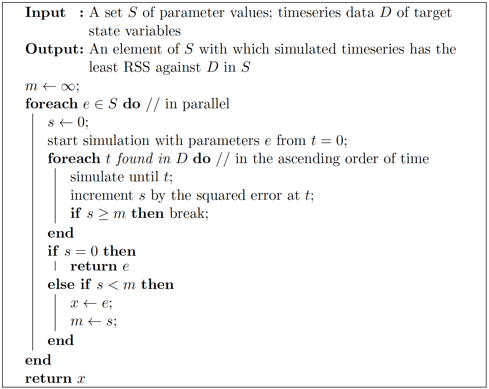

# Introduction

Understanding dynamics of biological or physiological systems often requires a
rigorous mathematical model that describes the hypotheses to be tested. It is
widely recognized that the class of ordinary differential equations (ODEs) is
suitable for describing the time course of variables in a deterministic system,
stemming from a simple assumption about the rate of their change.
One of such examples is the chemical reaction accelerated by an enzyme
following the Michaelis-Menten kinetics; another is the action potential of
cardiac cells driven by modulation of ion channels. As a consequence, recent
computational studies on composite intracellular models employs several
domain-specific languages such as CellML [@lloyd_cellml_2004], the Physiological
Hierarchy Markup Language (PHML) [@asai_databases_2015], or the Systems Biology
Markup Language (SBML) [@hucka_systems_2003], in order to make it easier for
researchers to edit models that implicitly specify the ODEs in problem.

We introduce `Flint`, a simulator software for models written in these
languages, which allows users to transform a given model into a set of ODEs and
solve it in a numerical manner. `Flint` facilitates efficient solvers
e.g. using the additive Runge-Kutta scheme implemented in the SUNDIALS library
[@hindmarsh2005sundials]. It also supports a non-deterministic extension of
ODEs, namely stochastic differential equations (SDE) [@higham_algorithmic_2001]
which makes it possible to involve random elements, e.g. noises, in the dynamics.

# Implementation

The larger the number of variables and parameters in a given model are, the more
resource-consuming its simulation becomes. It is also the case for estimating
plausible values of parameters consistent with the prior knowledge on the
behavior of the underlying system. Taking residual sum of squares (RSS) as a
measure of the goodness of fit, estimation of parameter values for ODEs turns
into a non-linear least-squares problem [@IMM2004-03215]. `Flint` deals with the
challenge the modeler faces when fitting the value of parameters via the
least-squares method, taking advantage of multithreading if available.
Given grid points in the parameter space as an input set, `Flint` performs the
following branch-and-bound algorithm to reduce the number of simultaneously
running jobs for the grid search:

Unlike existing heuristics for solving non-linear least-squares, the above
algorithm can find one of global minima, provided that the input grid contains
it. It is also easy to benefit from parallel computing to reduce processing
time. Users can define the range of each parameter as well as the way to
enumerate grid points, e.g. by a pseudo random number generator. The feature
will help researchers gain insight about a subset of parameter values of
biological/physiological interest at an early stage of modeling.

# Acknowledgements

We acknowledge Dr Masao Okita for his invaluable comments on shared-memory
parallelism implemented in `Flint`.

# References
